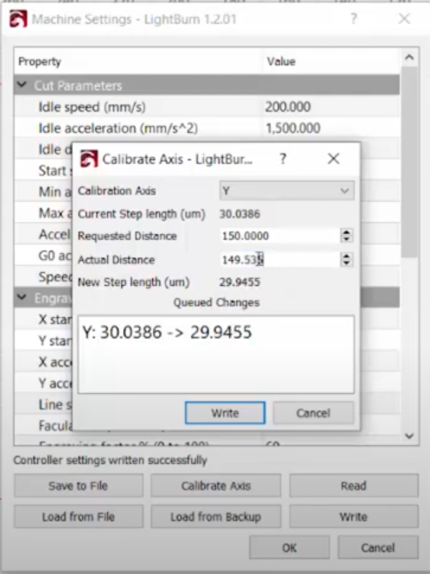

# Kaitian CM1309 Laser Cutter Calibration

You should not be afraid to calibrate your laser cutter.

### Materials:
1. Thin wood stock to cut and measure.
	1. Thin enough to cut with single pass at 75%
2. Accurate Digital Calipers.
3. Calculator.

## Measuring Procedure:
1. Put in wood piece and focus laser normally.
2. Cut what is theoretically a  150mm x 150mm square. If you have a larger accurate caliper do a bigger square.
3. Make a X Y grid every 15mm on the square with a straight edge.
4. Use a digital caliper to measure at each mark on the grid in each direction.

### Get the average in the X direction.
Use a digital caliper to measure at each mark on the grid in X direction.
Get the average in the X direction.
#### Example X direction grid
149.24
149.19
149.20
149.17
149.23
149.27

Avg = 149.216

### Get the average in the Y direction.
Use a digital caliper to measure at each mark on the grid in Y direction.
Get the average in the Y direction.
#### Example Y direction grid
149.52
149.55
149.52
149.54
149.54
149.54

Avg = 149.535

### LightBurn Procedure:
1. In LightBurn.
2. Get dialog box.
	1. Edit > Machine Settings
	2. Get dialog box with button on the bottom.
		1. Calibrate Axis.
			1. Dropdown X
				1. Actual Distance
					1. Enter Average for X before decimal from above, then enter the part average after decimal separately.
				2. Requested Distance
					1. 150.000
				3. Write Button. 
					1. Will send to machine.
			2. Dropdown Y
				1. Actual Distance
					1. Enter Average for Y before decimal from above, then enter the part average after decimal separately.
				2. Requested Distance
					1. 150.000
				3.  Write Button. 
					1. Will send to machine.

## Second Square
1. Repeat the cut square again at 150mm x 150mm.
2. Repeat measurement procedure.
3. Get Average.
4. Did it work?

# Kaitian CM1309 Laser Cutter Calibrated!

